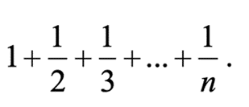

___
# МИНИСТЕРСТВО НАУКИ И ВЫСШЕГО ОБРАЗОВАНИЯ РОССИЙСКОЙ ФЕДЕРАЦИИ ФЕДЕРАЛЬНОЕ ГОСУДАРСТВЕННОЕ БЮДЖЕТНОЕ ОБРАЗОВАТЕЛЬНОЕ УЧРЕЖДЕНИЕ ВЫСШЕГО ПРОФЕСИОНАЛЬНОГО ОБРАЗОВАНИЯ «САХАЛИНСКИЙ ГОСУДАРСТВЕННЫЙ УНИВЕРСИТЕТ»
### ***<center>Лабораторная работа №4. «Основы языка JavaScript».</center>*** <br><p align="right">Подготовил студент направления подготовки 01.03.02 «Прикладная математика и информатика»<br> Института естественных наук и техносферной безопасности<br> Зураев Дмитрий Бакенович.</p><br><p align="right">Научный руководитель:<br> Соболев Евгений Игоревич</p><br> <center>Южно-Сахалинск 2023 г.</center>
___
### <center>Введение</center>
<p align="justify">JavaScript (JS) - это высокоуровневый язык программирования, который используется для создания интерактивных и динамических веб-страниц. JS является одним из трех основных языков, используемых веб-браузерами (наряду с HTML и CSS), и позволяет добавлять функциональность и взаимодействие на веб-страницах.
Лабораторная работа по JavaScript (JS) предоставляет возможность познакомиться с одним из самых популярных языков программирования, используемых для разработки веб-приложений.</p>

### <center>Цели</center>
<p align="justify"></p>

### <center>Задачи</center>
<p align="justify">Применить технологию JS.</p>

____________________
## <center>_Решение_</center>
1. Рассчитать значение у при заданном значении х<br>
<br>
```javascript
let x = parseInt(prompt("Введите x"));
if (x > 0)
    alert(Math.pow(Math.sin(x), 2));
else
    alert(1 - 2 * Math.sin(x*x));
```
2.	Дано натуральное число n (n<=9999). Выяснить, является ли оно палиндромом
("перевертышем") с учетом четырех цифр, как, например, числа 7777, 8338, 0330 и т. п. (Палиндромом называется число, десятичная запись которого читается одинаково слева направо и справа налево.)
```javascript
let n = parseInt(prompt("Введите n, проверю на полиндром"));
var numberString = n.toString();
var reversedString = numberString.split('').reverse().join('');
if (numberString === reversedString) {
    alert(true);
} else {
    alert(false);
}
```
3.	Год является високосным, если его номер кратен 4, однако из кратных 100 високосными являются лишь кратные 400, например, 1700, 1800 и 1900 — невисокосные года, 2000 — високосный. Дано натуральное число n. Определить, является ли високосным год с таким номером.
```javascript
let n = parseInt(prompt("Введите год: ")); //160000(400*400)
let res = n < 100 ? n % 4 : n % 400;
if (res == 0) 
    alert("Это год високосный");
else 
    alert("Это год невисокосный");
```
4.	Составить программу для вычисления значения функции y(x): <br>
<br>
```javascript
  let x = parseInt(prompt("Введите x"));
  if (x < -1) alert("-1");
  if (x > -1) alert(x);
  if (x == -1) alert("1");
```
5.	Составить программу, которая в зависимости от порядкового номера дня месяца (1, 2, ..., 12) выводит на экран время года, к которому относится этот месяц.
```javascript
let month = parseInt(prompt("Введите номер месяца"));
if (month == 12 || month == 1 || month == 2) 
    alert("Зима");
else if (3 <= month && month <= 5) 
    alert("Весна");
else if (6 <= month && month <= 8) 
    alert("Лето");
else if (9 <= month && month <= 11) 
    alert("Осень");
else 
    alert("Некорректный номер месяца");
```
6.	Мастям игральных карт условно присвоены следующие порядковые номера: масти "пики" — 1, масти "трефы" — 2, масти "бубны" — 3, масти "червы" — 4, а достоинству карт: "валету" — 11, "даме" — 12, "королю" — 13, "тузу" — 14 (порядковые номера карт остальных достоинств соответствуют их названиям: "шестерка", "девятка" и т. п.). По заданным номеру масти m (1 m 4) и номеру достоинства карты k (6 k 14) определить полное название (масть и достоинство) соответствующей карты в виде "Дама пик", "Шестерка бубен" и т. п.
```javascript
let m = parseInt(prompt("Введите номер масти: "));
let k = parseInt(prompt("Введите номер карты: "));
let suit = "";
let rank = "";
switch (m)
{
    case 1:
        suit = "пики";
        break;
    case 2:
        suit = "треф";
        break;
    case 3:
        suit = "буби";
        break;
    case 4:
        suit = "червы";
        break;
    default:
        alert("Неверный ввод m");
        return;
}

switch (k)
{
    case 6:
        rank = "Шестерка";
        break;
    case 7:
        rank = "Семерка";
        break;
    case 8:
        rank = "Восьмерка";
        break;
    case 9:
        rank = "Девятка";
        break;
    case 10:
        rank = "Десятка";
        break;
    case 11:
        rank = "Валет";
        break;
    case 12:
        rank = "Дама";
        break;
    case 13:
        rank = "Король";
        break;
    case 14:
        rank = "Туз";
        break;
    default:
        alert("Неверный ввод k");
        return;
}
alert(rank +" "+ suit);
```
7.	В некоторых странах Дальнего Востока (Китае, Японии и др.) использовался (и неофициально используется в настоящее время) календарь, отличающийся от применяемого нами. Этот календарь представляет собой 60-летнюю циклическую систему. Каждый 60-летний цикл состоит из пяти 12-летних подциклов. В каждом подцикле года носят названия животных: Крыса, Корова, Тигр, Заяц, Дракон, Змея, Лошадь, Овца, Обезьяна, Петух, Собака и Свинья. Кроме того, в названии года фигурируют цвета животных, которые связаны с пятью элементами природы — Деревом (зеленый), Огнем (красный), Землей (желтый), Металлом (белый) и Водой (черный). В результате каждое животное (и его год) имеет символический цвет, причем цвет этот часто совершенно не совпадает с его "естественной" окраской — Тигр может быть черным, Свинья — красной, а Лошадь — зеленой. Например, 1984 год — год начала очередного цикла — назывался годом Зеленой Крысы. Каждый цвет в цикле (начиная с зеленого) "действует" два года, поэтому через каждые 60 лет имя года (животное и его цвет) повторяется. Составить программу, которая по заданному номеру года нашей эры n печатает его название по описанному календарю в виде: "Крыса, Зеленый". Рассмотреть два случая: а) значение n 1984; б) значение n может быть любым натуральным числом.
```javascript
let year = parseInt(prompt("Введите год"));
var animals = ['Крыса', 'Корова', 'Тигр', 'Заяц', 'Дракон', 'Змея', 'Лошадь', 'Овца', 'Обезьяна', 'Петух', 'Собака', 'Свинья'];
var colors = ['Зеленый', 'Красный', 'Желтый', 'Белый', 'Черный'];

var subCycle = (year - 1984) % 60;
var animalIndex = subCycle % 12;
var colorIndex = Math.floor(subCycle / 12);

alert(animals[animalIndex] + ', ' + colors[colorIndex]);
```
8.	Напечатать таблицу умножения на 9.
```javascript
let result =  ""
  for (let i = 1; i <= 10; i++) {
  const x = 9 * i;
  result += `9 * ${i} = ${x}` + "\n";
  }
  alert(result);
```
9.	Напечатать "столбиком" значения sin 2 , sin 3 , ..., sin 20.
```javascript
 let result = "";
  for(let i = 1; i <= 20; i++)
    {
        result += `sin ${i} = ${Math.sin(i)}` + "\n";
    }
  alert(result);
```
10.	Найти: а) сумму всех целых чисел от 100 до 500; б) сумму всех целых чисел от a до 500 (значение a вводится с клавиатуры; a<=500); в) сумму всех целых чисел от –10 до b (значение b вводится с клавиатуры; b=>–10); г) сумму всех целых чисел от a до b (значения a и b вводятся с клавиатуры; b=>a).
```js
let result = 0;
for(let i = 100; i <=500; i++)
    result += i;
alert("а) Сумма всех чисел от 100 до 500 = " + result);

let a = parseInt(prompt("б) Введите a (a<=500)"));
if(a > 500) {
    alert("Число больше 500!");
    return;
}
result = 0;
for(let i = a; i <=500; i++)
    result += i;
alert(`Сумма всех чисел от ${a} до 500 = ${result}`);

let b = parseInt(prompt("в) Введите b (b=>–10)"));
if(b < -10)
{
    alert("Число меньше -10!");
    return;
}
result = 0;
for(let i =- 10; i <= b; i++)
{
    result += i;
}
alert(`Сумма всех чисел от -10 до ${b} = ${result}`);

a = parseInt(prompt("г) Введите a (b=>a)"));
b = parseInt(prompt("г) Введите b (b=>a)"));
if (a > b) {
    alert("Число a больше b!");
    return;
}
result = 0;
for (let i = a; i <= b; i++)
    result += i;
alert(`Сумма всех чисел от ${a} до ${b} = ${result}`);
```
11.	Вычислить сумму <br>

```js
let res = 1;
let n = prompt('Введите n: ');
for(let i = 2; i <= n; i++){
    res += 1/n;
}
alert("Сумма равна: " + res);
```
12.	Даны натуральные числа х и у. Вычислить произведение x и y, используя лишь операцию сложения. Задачу решить двумя способами.
```javascript
let x = parseInt(prompt("Введите x"));
let y = parseInt(prompt("Введите y"));

let result1 = x;
let result2 = y;
for (let i = 0; i < y-1; i++) result1+=x;
for (let i = 0; i < x-1; ++i) result2+=y;
alert("Первый способ: " + result1);
alert("Второй способ: " + result2);
```
13.	Составить программу возведения натурального числа в квадрат, учитывая следующую закономерность<br>

```javascript
  let x = parseInt(prompt("Введите n"));
  let result = 0;
  for (let i = 1; i <= x ; i++)
      result += 2 * i - 1;
  alert(x + "^2 = " + result);
```
14.	Вычислить сумму <br>

```javascript
let x = 0;
  for (let i = 50; i >= 1; i--)
  {
      x= Math.sqrt(i + x);
  }
  alert(x);
```
15.	Дана непустая последовательность целых чисел, оканчивающаяся нулем. Найти: а) сумму всех чисел последовательности; б) количество всех чисел последовательности.
```javascript
let numbers = [1, 2, 3, 3, 4, 3, 555, 0];
let sum = 0;
let count = 0;
for(let i = 0; numbers[i] != 0; i++)
{
    sum += numbers[i];
    count ++;
}
alert("1, 2, 3, 3, 4, 3, 555, 0\nСумма: " + sum );
alert("1, 2, 3, 3, 4, 3, 555, 0\nКол-во чисел: " + count );
```
16.	Дана непустая последовательность неотрицательных целых чисел, оканчивающаяся отрицательным числом. Найти среднее арифметическое всех чисел последовательности (без учета отрицательного числа).
```javascript
let numbers = [5, 3, 3, 4, -1];
let result = 0;
let sum = 0;
for(let i = 0; numbers[i] >= 0; i++)
{
    sum+= numbers[i];
}
result = sum / (numbers.length - 1);
alert("Среднее ариметическое 5, 3, 3, 4, -1: " + result);
```
17.	Дано натуральное число. Определить: а) количество цифр 3 в нем; б) сколько раз в нем встречается последняя цифра; в) количество четных цифр в нем. Составное условие и более одного неполного условного оператора не использовать; г) сумму его цифр, больших пяти; д) произведение его цифр, больших семи; е) сколько раз в нем встречаются цифры 0 и 5 (всего).
```javascript
let n = parseInt(prompt("Введите натуральное число: "));
var a = 0; //а
var b = 0; //б
var c = 0; //в
var d = 0; //г
var e = 1; //д
var f = 0; //е
var numberString = n.toString();
for (var i = 0; i < numberString.length; i++) {
    var digit = parseInt(numberString[i]);

    if (digit === 3) {
    a++;
    }

    if (digit === parseInt(numberString[numberString.length - 1])) {
    b++;
    }

    if (digit % 2 === 0) {
    c++;
    }

    if (digit > 5) {
    d += digit;
    }

    if (digit > 7) {
    e *= digit;
    }

    if (digit === 0 || digit === 5) {
    f++;
    }
}
alert(`Само число: ${numberString}\nКоличество цифр 3: ${a}\nСколько раз в нем встречается последняя цифра: ${b}\nКоличество четных цифр в нем: ${c}\nСумму его цифр, больших пяти: ${d}\nПроизведение его цифр, больших семи: ${e}\nКоличество раз в нем встречаются цифры 0 и 5(всего): ${f}`);
```
18.	Дано натуральное число, в котором все цифры различны. Определить: а) порядковый номер его максимальной цифры, считая номера: от конца числа; от начала числа; б) порядковый номер его минимальной цифры, считая номера: от конца числа; от начала числа.
```javascript
let number = parseInt(prompt("Введите натуральное число, в котором все цифры различны: ")); 
let digits = number.toString().split('').map(Number); 
    
let maxDigit = Math.max(...digits); 
let minDigit = Math.min(...digits); 
    
let reverseDigits = [...digits].reverse(); 
    
let maxIndexFromEnd = reverseDigits.indexOf(maxDigit) + 1; 
let maxIndexFromStart = digits.indexOf(maxDigit) + 1; 
    
let minIndexFromEnd = reverseDigits.indexOf(minDigit) + 1; 
let minIndexFromStart = digits.indexOf(minDigit) + 1; 
    
alert(`Порядковый номер максимальной цифры ${maxDigit} от конца числа: ${maxIndexFromEnd}\nПорядковый номер максимальной цифры ${maxDigit} от начала числа: ${maxIndexFromStart}\nПорядковый номер минимальной цифры ${minDigit} от конца числа: ${minIndexFromEnd}\nПорядковый номер минимальной цифры ${minDigit} от начала числа: ${minIndexFromStart}`);
```
19.	Дано натуральное число. Выяснить, является ли оно простым (простым называется натуральное число, большее 1, не имеющее других делителей, кроме единицы и самого себя). Оператор цикла с параметром не использовать.
```javascript
let n = parseInt(prompt("Введите натуральное число: "));
let value = 2;
while(value != n)
{
    if (n % value == 0)
    {
        alert("Число не простое");
        return;
    } 
    value++;
}
alert("Число простое");
```
20.	Дано натуральное число. Установить, является ли последовательность его цифр при просмотре их слева направо упорядоченной по возрастанию. Например, для числа 1478 ответ положительный, для чисел 1782 и 1668 — отрицательный и т. п.
```javascript
let n = parseInt(prompt("Введите натуральное число: "));
let nArr = n.toString().split('');//1321
let isOrder = true;
for(let i = 0; i <= nArr.length; i++){
    if(nArr[i] > nArr[i+1]){
        alert("Число не упорядочено");
        isOrder = false;
        break;
    }
}

if(isOrder){
    alert("Число упорядочено");
}
```
21.	Дана непустая и упорядоченная по возрастанию последовательность целых чисел, оканчивающаяся числом 10 000. Определить порядковый номер первого числа, большего заданного n. Если таких чисел в последовательности нет, то на экран должно быть выведено соответствующее сообщение.
```javascript
const sequence = [1, 3, 5, 7, 9, 10, 11, 13, 15, 18, 25, 50, 52, 731, 777, 3213, 10000]; 
let n = parseInt(prompt("Введите число n:\nа я определю порядковый номер первого числа, больше этого n "));
let index = null;
for (let i = 0; i < sequence.length; i++) { 
    if (sequence[i] > n) { 
        index = i + 1; 
        break; 
    } 
}
if (index)
    alert(`[1, 3, 5, 7, 9, 10, 11, 13, 15, 18, 25, 50, 52, 731, 777, 3213, 10000]\nПорядковый номер первого числа, большего ${n}, равен ${index}. Это число ${sequence[index-1]}`);
else 
    alert(`В последовательности нет чисел, больших ${n}`);
```
22.	Дано натуральное число. Верно ли, что цифра a встречается в нем реже, чем цифра b?
```js
let n = parseInt(prompt("Введите натуральное число n: \n//12344445667")); 
let a = prompt('Введите число a\n//4');
let b = prompt('Введите число b\n//6');
let countA = 0;
let countB = 0;
for(let i = 0; i < n.length-1; i++){
    if(n[i]==a) 
        countA++;
    if(n[i]==b) 
        countB++;
}
if(countA<countB) 
    alert(`Да, цифра ${a} встречается реже, чем ${b}`);
else 
    alert(`Нет, цифра ${a} не встречается реже, чем ${b}`);
```
23.	Имеется фрагмент программы в виде оператора цикла с параметром, обеспечивающий вывод на экран "столбиком" всех целых чисел от 10 до 30. Оформить этот фрагмент в виде: а) оператора цикла с предусловием; б) оператора цикла с постусловием.
```js
let num = 10; 
let output = 'Оператор цикла с предусловием\n'; 
while (num <= 30) { 
    output += num + '\n'; 
    num++; 
} 
alert(output); 

num = 10; 
output = 'Оператор цикла с постусловием\n'; 
do { 
    output += num + '\n';
    num++; 
} while (num <= 30); 
alert(output); 
```
<center><b>Задачи CodeWars:</b></center>

[1 Kata](https://www.codewars.com/kata/head-tail-init-and-last)
```javascript
function head(arr) { return arr[0]; }

function tail(arr) { return arr.slice(1); }

function init(arr) { return arr.slice(0, arr.length - 1); }

function last(arr) { return arr[arr.length - 1]; }
```
[2 Kata](https://www.codewars.com/kata/array-deep-count)
```javascript
function deepCount(a){
 let count = 0; 
     
    for (let i = 0; i < a.length; i++) { 
        count++; 
        if (Array.isArray(a[i])) { 
            count += deepCount(a[i]); 
        } 
    } 
     
    return count; 
}
```
[3 Kata](https://www.codewars.com/kata/length-of-missing-array)
```javascript
function getLengthOfMissingArray(arrayOfArrays) {
  const lengths = (arrayOfArrays || [])
    .map(a => a ? a.length : 0)
    .sort((a, b) => a - b)
  
  if (lengths.includes(0)) {
    return 0
  }

  for (let i = 0; i < lengths.length - 1; i++) {
    if (lengths[i] + 1 !== lengths[i + 1]) {
      return lengths[i] + 1
    }
  }

  return 0
}
```
[4 Kata](https://www.codewars.com/kata/pair-of-gloves)
```javascript
https://dev.to/cesar__dlr/4-pair-of-gloves-codewars-kata-6-kyu-1hlk
function numberOfPairs(gloves){

  var glovesObj = gloves.reduce((acc, el)=> {
    acc[el] = (acc[el] || 0) + 1;
    return acc;
  }, {})

  let r = 0;

  for(color in glovesObj){
    r+=Math.floor(glovesObj[color] / 2)
  }

  return r
}
```
[5 Kata](https://www.codewars.com/kata/sorting-by-bits)
```javascript
function sortByBit(arr) {
  function countBits(num) { 
    let count = 0; 
    while (num > 0) { 
      count += num & 1; 
      num >>= 1; 
    } 
    return count; 
  }

  arr.sort((a, b) => {
      let countA = countBits(a);
      let countB = countBits(b);

      if (countA === countB) {
          return a - b;
      }

      return countA - countB;
  });
}
```
[6 Kata](https://www.codewars.com/kata/lets-recycle)
```javascript
function recycle(array) { 
  let paperBin = []; 
  let glassBin = [];
  let organicBin = [];
  let plasticBin = [];

array.forEach(obj => { 
  if(obj.material === "paper") { 
    paperBin.push(obj.type); 
  } if(obj.material === "glass") { 
    glassBin.push(obj.type); 
  } if(obj.material === "organic") {
    organicBin.push(obj.type); 
  } if(obj.material === "plastic") {
    plasticBin.push(obj.type); 
  }

if(obj.secondMaterial) {
  if(obj.secondMaterial === "paper") {
    paperBin.push(obj.type);
  }
  if(obj.secondMaterial === "glass") {
    glassBin.push(obj.type);
  }
  if(obj.secondMaterial === "organic") {
    organicBin.push(obj.type);
  }
  if(obj.secondMaterial === "plastic") {
    plasticBin.push(obj.type);
  }
}
});

return [paperBin, glassBin, organicBin, plasticBin]; 
}   
```
## <center>_Вывод_</center>
Таким образом, мне удалось поработать с основами языка js
